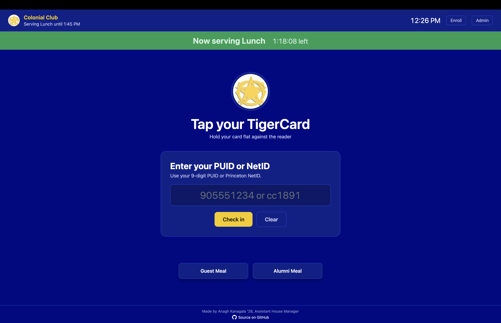
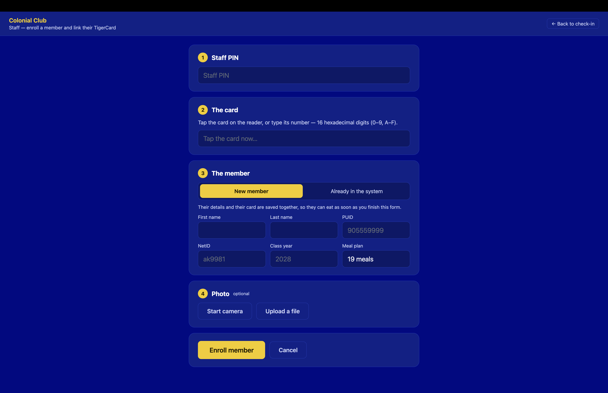
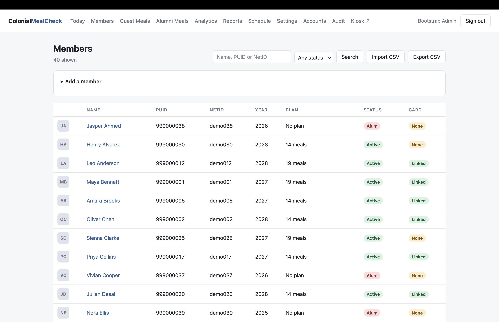
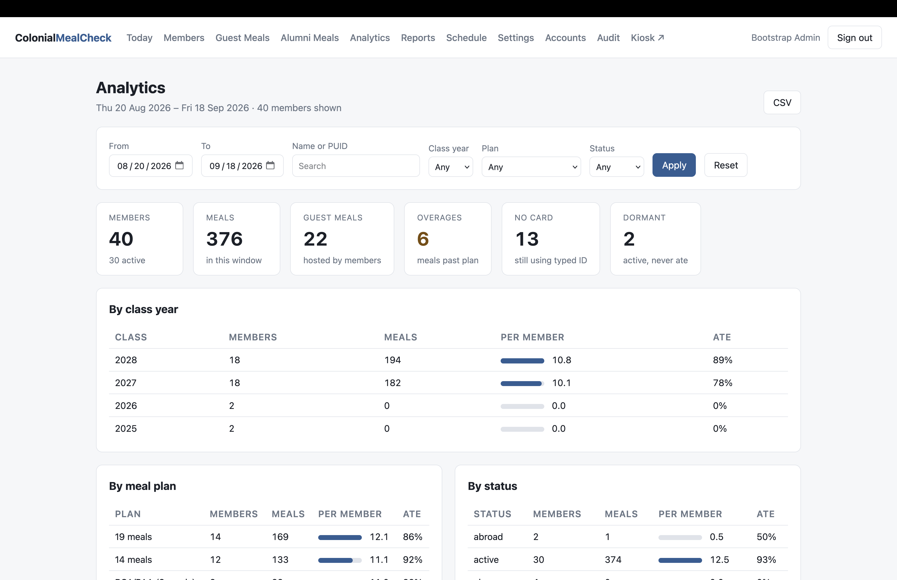

# Colo Meal Check

Colo Meal Check is the meal attendance and meal-plan management system for the
Colonial Club of Princeton. Members check in with a TigerCard, PUID, or NetID;
staff manage enrollment, guest and alumni meals, attendance, and reporting from
a browser.

The dining-room kiosk keeps check-in quick, while the management dashboard gives
the club a clear record of who ate, when they ate, and how meals count toward
weekly plans and monthly guest allowances. Meal Check is self-hosted, supports
offline check-in, and runs with Docker Compose.

## Screenshots

| Dining-room check-in | Staff enrollment |
| --- | --- |
| [](docs/screenshots/ColoMealCheck_LandingPage.png) | [](docs/screenshots/ColoMealCheck_EnrollmentPage.png) |
| Tap a TigerCard or enter an ID to check in; record guest and alumni meals from the same screen. | Enroll a new member or link a card to an existing member. |

| Member roster | Analytics |
| --- | --- |
| [](docs/screenshots/ColoMealCheck_MembersPage.png) | [](docs/screenshots/ColoMealCheck_AnalyticsPage.png) |
| Search and manage members, review card enrollment, and import or export the roster. | Review meal usage and participation across class years, meal plans, and membership statuses. |

Select a screenshot to view it at full size.

## Features

### Dining-room check-in

- **TigerCard, PUID, and NetID entry.** Tap a linked card or enter an ID manually.
  Members on the roster can use manual entry before their cards are enrolled.
- **Immediate feedback.** Results show the member's name, photo when available,
  meal-plan usage, and any overage or membership warning.
- **Live meal status.** The kiosk displays the current meal and time remaining,
  or a countdown to the next service.
- **Duplicate protection.** A second check-in for the same meal is prevented and
  opens the guest form with the member selected as host. Authorized staff can
  record a genuine second meal with an audited override.
- **Early and late meals.** When no service is open, members, guests, and alumni
  can select the previous or next meal. Attendance is recorded against that
  meal's service date.
- **Undo.** Recent check-ins can be undone within the configured time window.
- **Dedicated kiosk display.** The app supports a full-screen browser or
  installed web app, with connection status, queued-meal indicators, and a
  battery indicator where the browser supports it.

### Meal plans and allowances

Meal Check includes 19-meal, 14-meal, RCA/PAA (9-meal), and no-plan membership
options. Administrators can change weekly allotments, the first day of the meal
week, and the monthly guest allowance.

| Rule | Behavior |
| --- | --- |
| Weekly allowance | Resets on Monday by default; unused meals do not roll over. |
| Member exceeds their plan | The meal is recorded and flagged as an overage for staff review. |
| Member has a non-active status | The meal is recorded with a membership warning. |
| Guest allowance | Two meals per member per calendar month by default, separate from the member's weekly plan. |
| Guest allowance exhausted | Additional non-exempt guest meals require a staff override and reason. |
| Family and professor guests | Meals are recorded without using the host's guest allowance. |
| Alumni meals | Recorded independently of member plans and guest allowances. |

### Guest and alumni meals

**Guest meals** are linked to a hosting member. Staff can start from a member's
check-in result or search for a host from the Guest Meal form. Each guest record
includes a first and last name, plus a Princeton NetID or a reason the guest has
no NetID. Family and professor categories are exempt from the monthly quota and
may omit the NetID and reason. These meals still appear in attendance and reports.

**Alumni meals** require no member host. The form records the alum's name, class
year, and at least one contact method: email or phone. A Princeton NetID is
optional. Dedicated Guest Meals and Alumni Meals pages provide monthly histories
with guest identities, hosts, categories, and alumni contact details.

### Member roster and enrollment

- **Member profiles.** Manage names, PUIDs, NetIDs, class years, meal plans,
  membership status, notes, and photos. Profiles show current usage, linked
  cards, and recent attendance.
- **Search and export.** Find members by name, PUID, or NetID, filter by status,
  and export the roster as CSV.
- **CSV roster import.** Preview additions, updates, unchanged rows, and errors
  before importing. Members are matched by PUID; blank update cells preserve
  existing values, and invalid rows are skipped with explanations. Imports
  preserve linked cards and photos.
- **Staff enrollment.** Create a member and link their TigerCard in one step,
  with a required PUID and NetID and an optional webcam photo or uploaded image.
  Field validation and conflict checks help prevent incorrect enrollments.
- **Replacement cards.** Link a new card to an existing member and automatically
  retire the old one. Staff can also revoke cards from member profiles.
- **Enrollment tracking.** An enrollment-gaps report lists active members who
  still need a card linked.

CSV imports require `first_name`, `last_name`, and `puid`. Optional columns are
`netid`, `class_year`, `plan_type`, and `status`. Common headers such as
“First Name” and “Class Year” are accepted. Cards are linked through enrollment.

### Attendance management

The daily dashboard shows member, guest, and alumni totals by meal, alongside
individual entries, entry methods, overages, and warnings. Staff can select a
past date, export daily attendance, and remove incorrect entries.

Administrators can **register past meals** for members, guests, and alumni by
choosing a service date and a completed meal period. Duplicate checks, member
overages, guest quotas, and category exemptions apply. Entries are marked as
admin entries, and the audit log records who added them and when. Past-meal
registration uses saved period times and current plan and quota settings.

### Reports and analytics

Operational reports include:

- Weekly meal usage, remaining allowances, overages, and guest meals hosted.
- Monthly overages and guest-meal totals by host.
- Daily attendance, including guest and alumni details.
- Enrollment gaps and member roster exports.

The Analytics page supports any date range, with filters for class year, meal
plan, membership status, name, PUID, and NetID. Sortable member metrics include
meals eaten, meals per week, share of plan used, days attended, guests hosted,
overages, and last attendance. It also identifies active members with no meals
in the selected period.

Club-wide breakdowns by class year, plan, and status show participation and usage
across the membership. Analytics CSV exports preserve the selected date range,
filters, and sort order.

### Schedule and club settings

Administrators can add and retire meal windows, choose which windows count
toward weekly allowances, and configure service that runs past midnight. Meals
are assigned to service dates in the club's time zone, including overnight
service and daylight-saving transitions. The schedule page shows weekly meal
capacity and flags a mismatch with the full meal plan.

The default schedule serves 19 meals per week:

| Meal | Days | Hours |
| --- | --- | --- |
| Breakfast | Monday–Friday | 8:00–10:00 am |
| Lunch | Monday–Friday | 11:45 am–1:45 pm |
| Brunch | Saturday–Sunday | 11:30 am–1:30 pm |
| Dinner | Every day | 5:45–7:45 pm |

Club settings also control the kiosk result-display duration and undo window.
Changes take effect without redeploying the application.

### Staff access and audit history

Individual staff and administrator accounts provide access to the management
dashboard. Staff handle routine roster and attendance work; administrators also
manage imports, past-meal registration, schedules, club settings, accounts, and
audit history.

Administrators can create accounts, change roles, reset passwords, and deactivate
access. The protected root administrator is configured on the server. A separate
staff PIN authorizes kiosk enrollment and overrides.

The audit log records actions such as quota overrides, forced check-ins,
attendance corrections, past-meal entries, card changes, roster imports, and
changes to member plans or status.

### Offline operation

The kiosk saves member check-ins, guest meals, and alumni meals locally when the
server is unavailable. It automatically retries when connectivity returns,
preserving the original meal time for entries within the 24-hour replay window.
The queue survives browser restarts when browser storage is retained.

A previously loaded kiosk can reopen from its local cache when used over HTTPS
or another supported secure browser context. Offline results show that a meal
was saved; names, photos, usage counts, and member search require the server.
Guests can be queued by having the host tap their card and selecting **+ Guest**.

Entries that expire or cannot be accepted appear in a persistent **scans not
recorded** list for staff follow-up and manual registration. Keep the kiosk on
the same web address and browser profile so its queue and cache remain available.

## Getting started

You need Docker with Docker Compose on the server and a browser on the kiosk.
A compatible card reader enables TigerCard entry; manual PUID and NetID entry
also work.

You do not need to clone the repository or build the Docker image. Download
[`docker-compose.deploy.yml`](docker-compose.deploy.yml) as `docker-compose.yaml`
to run the prebuilt image from GitHub Container Registry.

1. Download [`docker-compose.deploy.yml`](docker-compose.deploy.yml) and save it
   as `docker-compose.yaml` in a new directory on the server. Download
   [`.env.example`](.env.example) into the same directory and save it as `.env`.

2. Edit `.env` to set `SECRET_KEY`, `POSTGRES_PASSWORD`, `STAFF_PIN`, and
   `ADMIN_PASSWORD`. Set `ADMIN_USERNAME` and `TIMEZONE` as needed. The example
   file includes a command to generate a secret key.

3. From that directory, start the application. Docker Compose downloads the
   images automatically:

   ```bash
   docker compose up -d
   ```

   If the image requires authentication, first run
   `docker login ghcr.io -u <your-github-username>` using a GitHub token with
   `read:packages` permission and access to the package.

4. Open `http://<server-host>:8000/admin`, sign in, and add or import the roster.
   Review the schedule and club settings, then open the kiosk at
   `http://<server-host>:8000/`.

| Page | Address |
| --- | --- |
| Check-in kiosk | `/` |
| Staff card enrollment | `/enroll` |
| Attendance dashboard | `/admin` |
| Member roster | `/admin/members` |
| Guest and alumni histories | `/admin/guests`, `/admin/alumni` |
| Analytics and reports | `/admin/analytics`, `/admin/reports` |
| Schedule and club settings | `/admin/schedule`, `/admin/settings` |
| Account management and audit history | `/admin/accounts`, `/admin/audit` |

The root administrator's configured password is applied at startup. To change
it, update `.env` and run `docker compose up -d`. If `ADMIN_PASSWORD` is left
blank on first startup, Meal Check generates a password and prints it once in
`docker compose logs api`. Keep `.env` on the server.

The application and PostgreSQL run in separate containers, with persistent
volumes for the database and member photos. Database migrations and initial
settings are applied automatically at startup. To update to the latest published
image, run `docker compose pull` followed by `docker compose up -d` from the
same directory.

If you want to build from source instead, clone the repository and run
`docker compose up -d --build` with the default `docker-compose.yml`.

For the dining-room deployment, follow the [deployment guide](DEPLOYMENT.md),
which covers private access through Tailscale, HTTPS, and Chromebook kiosk setup.
HTTPS enables webcam capture, offline startup, and web-app installation. For a
supported desktop Chrome kiosk on the local network, the repository includes
[`run-kiosk.sh`](run-kiosk.sh).

### Card readers

Meal Check accepts a keyboard-wedge reader that types a stable card serial and
presses Enter. For the standard TigerCard enrollment flow, configure the reader
to output the full 16-character hexadecimal serial with no prefix, padding, or
truncation. A reader using PC/SC can connect through the optional
[local reader bridge](bridge/README.md).

## Guides and operations

- [Kiosk quick start](docs/KIOSK_QUICK_START_GUIDE.md) — daily check-in and common
  attendant tasks.
- [Kiosk attendant guide](docs/KIOSK_ATTENDANT_GUIDE.md) — enrollment, replacement
  cards, guests, alumni, offline recovery, and troubleshooting.
- [Deployment guide](DEPLOYMENT.md) — server, network, HTTPS, and kiosk setup.
- [Backups and recovery](BACKUPS.md) — database and photo backups, automation,
  restoration, and recovery procedures.
- [Reader bridge](bridge/README.md) — connecting and operating a PC/SC reader.

## License

Meal Check is licensed under the Apache License, Version 2.0. See
[LICENSE](LICENSE) and [NOTICE](NOTICE).
